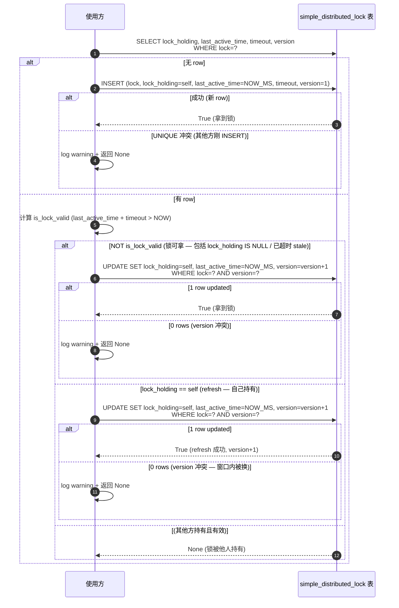
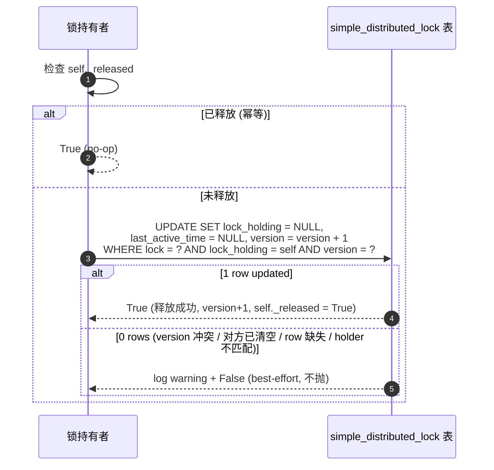
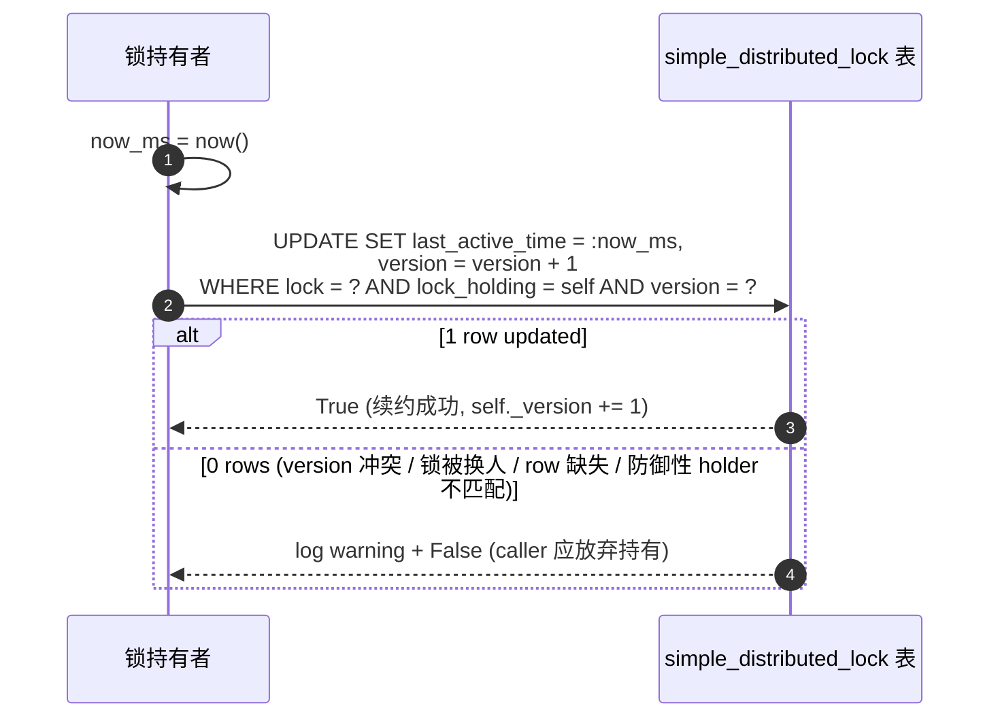

##  设计目的

主要是针对小型项目，只是使用了数据库的场景，期间可能涉及到多进程或者分布式抢占资源的问题，因而需要一个简易的分布式锁来控制资源的独占。

*题外话：整个方案更多是分享一个思路，依赖数据库的acid的特性来实现并发/并行的资源抢占*

##  设计目标

实现一个**简易的分布式锁**，满足：
1. **只依赖DB**
2. **多副本安全**：N 个进程并发抢锁，同一 task 同时刻只有一个 holder
3. **锁会过期释放**


## 设计逻辑

### 锁的数据结构

所谓锁，就是对一个资源的独占说明，同时为了保证持有锁的对象不因为自身的异常导致锁一直被占用，需要对锁设置一个超时，那么自然而然有如下核心的数据结构：

simple_distributed_lock 表

| 字段                    | 含义                                                                                                        |
| --------------------- | --------------------------------------------------------------------------------------------------------- |
| `lock`                | 锁名，一般指要独占的资源，**唯一**                                                                                       |
| `lock_holding_object` | 持有者标识，可以看出当前谁持有锁                                                                                          |
| `last_active_time`    | 上次心跳时间（epoch 毫秒），和超时一起用来判断持有锁的对象是否正常                                                                      |
| `timeout`             | 超时时长（毫秒），由 lock_holder 申请时指定                                                                              |
| `version`             | 为了解决并发更新使用version来控制并发更新（select version ； update 要更新字段，version = version + 1 where version= 查出来的version ） |

整个数据结构是承载在支持acid的数据库上，用version（乐观锁，Compare And Swap）来控制并发更新。

###  锁的用法

整个用法是这样的：

+ 每个使用方获取锁之前，先查下是否有锁且锁是否有效（检查last_active_time 加上 timeout 是否小于当前时间来确定），如果锁有效，且lock_holding_object不是自己的标识，那么就放弃或者过一段时间再获取。
+ 如果没有锁，或者锁无效，就可以通过insert（因为有lock有唯一索引，不怕并发），或者使用对version字段（Compare And Swap）update 锁的字段（每一次update都需要version + 1）
+ 拿到锁之后，使用方要定期更新last_active_time，防止锁超时，每次更新都要检查where lock_holding_object 是不是自己的（只能更新自己持有的锁，因为持有可能超时了，锁被抢了）
+  锁用完之后，要释放锁lock_holding_object 置空（只能释放自己持有的锁，因为持有可能超时了，锁被抢了）
+ 如果因为某些原因，使用方没有及时更新last_active_time，导致自己去更新的时候，lock_holding_object 被改了，那么使用方应该放弃使用了，丢弃自己的任务了
+  持有锁的对象，每次更新失败的时候（version被改了，不是自己查的那个），都需要重新查一次，检查上述相关的内容，然后根据结果看是否更新还是放弃


#### 已知缺陷（acknowledged by user spec）

 目前这个方案还是有个缺陷，就是申请锁之后，使用方持有锁超时了，但是使用方其实还在持有（但此时锁已经被抢走了），它需要再次上报last_active_time才能发现。目前我们的项目主要做的内容都是幂等的任务，锁只是减少正常情况的重复执行，空耗资源。

具体场景：
```

T=0 : 拿到锁

T=1 : timeout=N ms

T=N+1 : 已经超时, 但 holder 还在跑

T=N+5 : 下一次心跳检查, UPDATE 0 rows, 放弃

```

在这段时间（超时 → 下次心跳）的"dead interval"里, holder 仍然认为自己持有锁。
一般来说任务几乎很小概率会超时且没有挂掉，只要超时设置合理。

*题外话：要弥补这个缺陷其实也有很多办法，比如在抢锁之前再通过额外的指标确认持有者是否正常或者强制杀死，对于幂等的任务来说，不需要那么复杂*

### 核心挑战与取舍

| 挑战 | 选择 | 理由 |
|---|---|---|
| **锁存哪** | 业务 DB 表 + CAS UPDATE | 零外部依赖; 锁状态可 SQL 查询; 跨 DB 可移植; 性能远超需求 |
| **并发控制** | `version` 字段 + 乐观 CAS | 标准做法; 比 SELECT FOR UPDATE 简单; 不持锁 |
| **超时机制** | `last_active_time + timeout` vs now | 应用层判定 (避免 DB 触发器 / 定时任务清理); 简单可移植 |
| **心跳 vs 长连接** | 周期性 UPDATE | 实现简单; 失败即放弃 |
| **超时后立即让位** | **不实现** (acknowledged) | 操作幂等 + 超时保守设置, 接受"超时不立刻退出" |
| **UPDATE 失败怎么办** | **重新检查，检查不通过则放弃** | caller 拿到失败结果自行决定放弃还是再更新一次 |

## 实现
核心实现就是三个接口：获取锁、释放锁、心跳续期

###  获取锁

#### 接口
```python
def try_acquire(
    session: Session,
    *,
    lock: str,            # 锁名, 与表里 PK 对应 (e.g. "person_simple_collector")
    holder: str,          # 持有者标识 (e.g. "{hostname}:{pid}:{uuid8}")
    timeout_ms: int,      # 锁 TTL, 心跳超时阈值
) -> SimpleDistributedLock | None:
    """§设计逻辑 获取锁

    - 拿到锁 → SimpleDistributedLock 对象
    - 没拿到 → None 

    N 个 caller 并发抢同一把锁, DB UNIQUE 约束保证只有一个 INSERT 成功,
    其他 N-1 拿到 None
    """
```

SimpleDistributedLock 是 `try_acquire` 成功时返回的锁句柄，封装了 `session + holder + version` 三件套，调用方拿到后只管调 `heartbeat()` / `release()`，不用关心 version 细节（version 由锁对象自动管理）。

| 私有字段 | 含义 |
|---|---|
| `_session: Session` | DB 会话, 由 `try_acquire` 传入, 调用方负责生命周期 (锁对象不 close) |
| `_lock_name: str` | 锁名 (与表 PK 对应) |
| `_holder: str` | 持有者标识 (与表 `lock_holding_object` 字段对应) |
| `_version: int` | 当前乐观版本, 每次 `heartbeat()` 成功 +1, `release()` 成功也 +1; 0 rows 时不 bump, 单调性靠 DB 兜底 |
| `_released: bool = False` | `release()` 幂等标志, 1 row updated 后置 True, 重复调用直接返回 True 不发 SQL |

| 公开属性 (只读) | 含义 |
|---|---|
| `version: int` | 当前 version (heartbeat 成功后自增) |
| `lock_name: str` | 锁名 |
| `holder: str` | 持有者标识 |

**方法**（接口签名 / 流程见各小节）：

- `heartbeat() -> bool` — 续约, 见 §心跳续期
- `release() -> bool` — 释放, 见 §释放锁

#### 流程




### 释放锁

#### 接口

```python
class SimpleDistributedLock:
    def release(self) -> bool:
        """§设计逻辑 释放锁流程. best-effort, 幂等.

        - True  = 自己释放成功 / 已释放 (idempotent: 重复调用直接返回 True)
        - False = 0 rows (对方已清空 / row 缺失 / 防御性 holder 不匹配)
                 → log warning, 不抛 (释放是 best-effort, 锁归零是合法终态)
        """
```

#### 流程




###  心跳续期

#### 接口

```python
class SimpleDistributedLock:
    def heartbeat(self) -> bool:
        """§设计逻辑 心跳更新流程. 续约 last_active_time + 自增 version.

        - True  = 仍持有锁
        - False = 锁状态已变 (0 rows: 被人抢走 / 超时让位 / 防御性 holder 不匹配)
                 → log warning, caller 应放弃持有
        """
```


#### 流程

